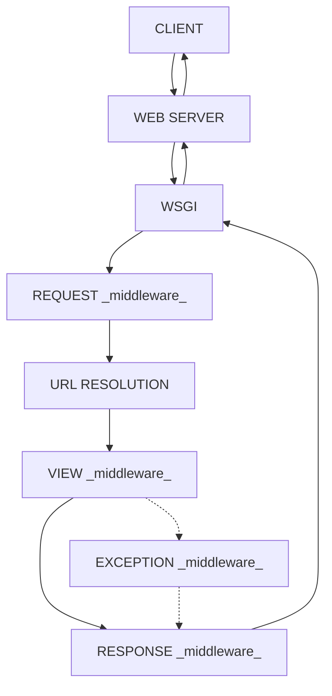

# Software Engineer Interview Questions

## Contents

1. [What are literals in Python?](#what-are-literals-in-python)
2. [Difference between CRUD and RESTful API](#difference-between-crud-and-restful-api)
3. [What is serialization and deserialization? How is it used in Python?](#what-is-serialization-and-deserialization-how-is-it-used-in-python)
4. [Principles to build a RESTful API](#principles-to-build-a-restful-api)
5. [Database sharding](#database-sharding)
6. [Getting 4th highest salary from a table](#getting-4th-highest-salary-from-a-table)
7. [Concepts of kubernetes and how it manages containers](#concepts-of-kubernetes-and-how-it-manages-containers)
8. [Pointer vs Reference](#pointer-vs-reference)
9. [Heap memory structure vs Stack memory structure](#heap-memory-structure-vs-stack-memory-structure)
10. [An interesting problem in c++](#an-interesting-problem-in-c++)
11. [What mock do in pytest](#what-mock-do-in-pytest)
12. [What is the purpose of an index in PostgreSQL, and how does it improve query performance?](#what-is-the-purpose-of-an-index-in-postgresql-and-how-does-it-improve-query-performance)
13. [Explain the ACID properties of transactions in PostgreSQL. Write an example demonstrating how to use BEGIN, COMMIT, and ROLLBACK](#explain-the)
14. [How can you store and query JSON data in PostgreSQL? Given a products table with a column details of type JSONB, write a query to find products where the category key in the JSON contains the value electronics](#how-can-you-store-and-query-json-data-in-postgresql-given-a-products-table-with-a-column-details-of-type-jsonb-write-a-query-to-find-products-where-the-category-key-in-the-json-contains-the-value-electronics)
15. [Abstract class vs Interface](#abstract-class-vs-interface)
16. [Advantages and disadvantages of using a microservices architecture](#advantages-and-disadvantages-of-using-a-microservices-architecture)
17. [Django vs Fastapi](#django-vs-fastapi)
18. [HTTP vs gRPC vs Message Queue Broker](#http-vs-grpc-vs-message-queue-broker)
19. [Rate Limiting](#rate-limiting)
20. [REST API versioning](#rest-api-versioning)
21. [Django Request/Response Cycle](#django-request-response-cycle)

### What are literals in Python?

Literal's in Python is defined as a data which is given in a variable or constant. Python supports the following 5 types of literals:

- String literals -> `"abc"`
- Numeric literals -> `123`
- Boolean literals -> `True` or `False`
- Literal Collections -> `List`, `Tuple`, `Dictionary`, `Set`
- Special literals -> `None`

### Difference between CRUD and RESTful API

- CRUD stands for Create, Read, Update, and Delete. It is a set of operations that can be performed on a resource.
- RESTful API is an architectural style that uses HTTP requests to perform CRUD operations. It is based on the principles of REST (Representational State Transfer).
- CRUD operations are specific actions that can be performed on a resource, while RESTful API is a design pattern that uses HTTP methods to interact with resources.

### What is serialization and deserialization? How is it used in Python?

- Serialization is the process of converting a data structure or object into a format that can be stored or transmitted. It is used to save the state of an object or data structure to a file or memory buffer.
- Deserialization is opposite.
- In python, serializer converts complex data types like Django QuerySets and Models into native Python data types which can be easily rendered into JSON, XML, or other content types.

Extend base serializer

```python
from rest_framework import serializers
from .models import MyModel

class MyModelSerializer(serializers.ModelSerializer):
    class Meta:
        model = MyModel
        fields = '__all__'
```

Use serializer

```python
from .models import MyModel
from .serializers import MyModelSerializer

queryset = MyModel.objects.all()

serializer = MyModelSerializer(queryset, many=True)
print(serializer.data)
```

### Principles to build a RESTful API

There are several principles to keep in mind when building a RESTful API:

- **Use HTTP methods** (GET, POST, PUT, DELETE) to perform CRUD operations on resources.
- **Client-server architecture:** The client and server should be separate entities that communicate through a well-defined interface.
- **Stateless:** Each request from a client to the server must contain all the information necessary to understand the request, and the server should not store any client state between requests.
- **Cacheable:** Responses must be explicitly marked as cacheable or non-cacheable.
- **Layered system:** The client should not be able to tell whether it is connected directly to the end server or an intermediary.
- **Uniform interface:** This principle simplifies and decouples the architecture, which helps to improve the scalability of the system.
- **Code on demand (optional):** Servers can temporarily extend or customize the functionality of a client by transferring executable code.

### Database sharding

Database sharding is a method of horizontal partitioning in which rows of a database table are divided into multiple partitions or shards. Each shard is stored on a separate server instance, which allows for parallel processing and improved performance. Sharding is commonly used to distribute the load of a large database across multiple servers, thereby increasing scalability and reducing the risk of data loss. However, sharding can also introduce complexity and potential challenges, such as data consistency and maintenance issues.
complexities:

- Data distribution: Deciding how to distribute data across shards can be complex, especially when dealing with uneven data distribution or changing data access patterns.
- Data consistency: Ensuring data consistency across shards can be challenging, as updates to data may need to be propagated to multiple shards.

### Getting 4th highest salary from a table

```sql
SELECT name, salary FROM employee
WHERE salary = (
    SELECT DISTINCT salary
    FROM employee
    ORDER BY salary DESC
    LIMIT 1 OFFSET 3
);
```

if it's postgresql, we can use rank() function

```sql
SELECT name, salary FROM (
    SELECT name, salary, rank() OVER (ORDER BY salary DESC) as r
    FROM employee
) as emp
WHERE r = 4;
```

postgresql also has more method on `OVER` clause like
`ROW_NUMBER()`, `RANK()`, `DENSE_RANK()`, `PERCENT_RANK()`, `CUME_DIST()`, `NTILE()`, `LAG()`, `LEAD()`, `FIRST_VALUE()`, `LAST_VALUE()`, `NTH_VALUE()`

| Function         | Description                                                                                                      |
| ---------------- | ---------------------------------------------------------------------------------------------------------------- |
| `ROW_NUMBER()`   | Assigns a unique sequential integer to rows within a partition, starting from 1.                                 |
| `RANK()`         | Assigns a unique rank to rows within a partition, with gaps for tied values (e.g., 1, 2, 2, 4).                  |
| `DENSE_RANK()`   | Similar to `RANK()`, but without gaps for ties (e.g., 1, 2, 2, 3).                                               |
| `PERCENT_RANK()` | Calculates the relative rank of a row within a partition as a percentage (between 0 and 1).                      |
| `CUME_DIST()`    | Calculates the cumulative distribution of a value in a partition, showing the percentage of rows below or equal. |
| `NTILE(n)`       | Divides rows in a partition into `n` equal groups, assigning a number (1 to `n`) to each group.                  |
| `LAG()`          | Accesses data from the previous row in the partition, useful for comparisons.                                    |
| `LEAD()`         | Accesses data from the next row in the partition, useful for comparisons.                                        |
| `FIRST_VALUE()`  | Returns the first value in an ordered partition.                                                                 |
| `LAST_VALUE()`   | Returns the last value in an ordered partition.                                                                  |
| `NTH_VALUE(n)`   | Returns the `n`-th value in an ordered partition.                                                                |

### Concepts of kubernetes and how it manages containers

- Kubernetes is an open-source container orchestration platform that automates the deployment, scaling, and management of containerized applications.
- _pods_: A pod is the smallest deployable unit in Kubernetes, consisting of one or more containers that share resources and are scheduled together on the same node.
- _kubelet_: The kubelet is an agent that runs on each node in the cluster and is responsible for managing the pods and containers on that node.
- _nodes_: A node is a physical or virtual machine that runs the Kubernetes software and can host multiple pods.
- _load balancing_: Kubernetes provides built-in support for load balancing, allowing traffic to be distributed across multiple pods to ensure high availability and scalability.
- _scaling_: Kubernetes supports horizontal scaling, allowing additional pods to be added or removed dynamically based on resource usage and demand.

In summary, Kubernetes inhances the docker container power in terms of scaling, load balancing, and managing the containers in production environment.

### Pointer vs Reference

- At some extent they are similar, as pointer is low level concept and reference is high level concept.
- Pointer is a variable that stores the memory address of another variable, while reference is an alias for a variable.
- Pointer has its own memory address and size, while reference does not have its own memory address and size.

```cpp
int a = 10;
int *p = &a; // p is a pointer to a
int &r = a; // r is a reference to a
```

### Heap memory structure vs Stack memory structure

- **Stack memory structure**:
  - Stack memory is linear and follows LIFO (Last In First Out) order.
  - Stack memory is temporary; it holds data that only needs to exist within the current function or block. when the function or block ends, the memory is automatically deallocated.
  - Allocation and deallocation are automatically handled by the compiler.
  - Example:
    - Local variables, function parameters, return addresses, etc.
- **Heap memory structure**:
  - The heap is a larger pool of memory with no inherent structure or order. Allowing dynamic memory blocks of any size, anywhere within its space.
  - Primary used for for dynamic memory allocation, allowing memory to be allocated at the runtime as needed. Objects, dynamic arrays and data structures that need to persist beyond a single function call or score are stored in the heap.
  - Heap memory persists as long as the program runs, and it must be explicitly deallocated by the program.
- **NOTE**:
  - `Before c++11`, we need to manually deallocate the memory allocated in heap using `delete` keyword. But after c++11, we can use smart pointers like `std::unique_ptr`, `std::shared_ptr`, `std::weak_ptr` to automatically deallocate the memory.
  - In `python`, each object has a reference count, and when the reference count drops to zero, the memory is deallocated automatically by the garbage collector.
  - `Java` and `C#`, use a technique where the garbage collector periodically scans the heap memory to identify and deallocate objects that are no longer in use.

### An interesting problem in c++

```cpp
char ch = 1;

while (ch < 500) {
    printf("%d ", ch);
    ch++;
}
```

What's funny here is, this will run, but as char accepts from -128 to 127, it will print from 1, 2, ..., 127, -128, -127, ..., -1,0, 1 and so on infinitely. This is because of the overflow of char data type.

### What mock do in pytest

- Mocking is a technique used in testing to replace a real object with a fake object that can be controlled and inspected during the test.
- In pytest `@mock.patch('some_function_path')` means that whenever `some_function_path` is called in the entire test from anywhere, it will be replaced with a mock object.
- `mock.Mock()` is a class that can be used to create mock objects with custom behavior and attributes.

### What is the purpose of an index in PostgreSQL, and how does it improve query performance?

**What is the purpose of an index in PostgreSQL?**

- An index in PostgreSQL helps speed up data retrieval operations by reducing the amount of data PostgreSQL needs to scan. Without an index, the database performs a sequential scan over the entire table, which can be slow for large datasets.

**Example of creating an index:**

```sql
CREATE INDEX idx_users_last_name ON users(last_name);
```

### Explain the ACID properties of transactions in PostgreSQL. Write an example demonstrating how to use BEGIN, COMMIT, and ROLLBACK

1. **Atomicity**: A transaction is atomic, meaning that it either completes in its entirety or is fully rolled back. If any part of the transaction fails, the entire transaction is rolled back.
2. **Consistency**: A transaction must leave the database in a consistent state. If the database was consistent before the transaction, it must remain consistent after the transaction.
3. **Isolation**: Transactions should be isolated from each other, meaning that the changes made by one transaction should not be visible to other transactions until the changes are committed.
4. **Durability**: Once a transaction is committed, the changes made by the transaction should be permanent and survive system failures.

**Example of using BEGIN, COMMIT, and ROLLBACK in PostgreSQL:**

```sql
-- Start a transaction
BEGIN;

-- Perform some operations
UPDATE accounts SET balance = balance - 500 WHERE account_id = 1;
UPDATE accounts SET balance = balance + 500 WHERE account_id = 2;

-- Commit the transaction if everything is successful
COMMIT;

-- If an error occurs, rollback the transaction
ROLLBACK;
```

### How can you store and query JSON data in PostgreSQL? Given a products table with a column details of type JSONB, write a query to find products where the category key in the JSON contains the value electronics

- PostgreSQL supports the JSON and JSONB data types for storing `JSON` data. `JSONB` is preferred for better performance with indexing and querying
  Example Query: Given a products table with a column details of type JSONB, this query retrieves products where the category key has the value electronics:

```sql
SELECT * FROM products
WHERE details->>'category' = 'electronics';
```

### Abstract class vs Interface

| Feature              | Abstract Class                                          | Interface                                  |
| -------------------- | ------------------------------------------------------- | ------------------------------------------ |
| Methods              | Can have both abstract and concrete methods.            | Can only have abstract methods.            |
| Constructor          | Can have a constructor.                                 | Cannot have a constructor.                 |
| Fields/Variables     | Can have fields/variables.                              | Can only have constants                    |
| Access Modifiers     | Can have access modifiers (public, private, protected). | All methods are public by default.         |
| Multiple Inheritance | A class can extend only one abstract class.             | A class can implement multiple interfaces. |

### Advantages and disadvantages of using a microservices architecture

1. Advantages:

- Scalability: Microservices can be scaled independently, allowing for better resource utilization and performance.
- Flexibility: Different microservices can be developed using different technologies and programming languages, allowing teams to choose the best tools for their needs.
- Resilience: If one microservice fails, it does not necessarily bring down the entire system, improving overall system reliability.
- Faster development: Teams can work on different microservices simultaneously, leading to faster development cycles and quicker time to market.

2. Disadvantages:

- Complexity: Microservices introduce additional complexity in terms of deployment, communication, and data management.
- Overhead: Each microservice requires its own resources, which can lead to increased overhead and resource consumption.
- Data consistency: Ensuring data consistency across multiple microservices can be challenging, especially when dealing with distributed transactions.
- Monitoring and debugging: Monitoring and debugging microservices can be more complex than monolithic applications, as issues may arise from interactions between multiple services.

### Django vs Fastapi

- **Features** of Django

  - It provides a good sense of security by avoiding common threats like cross-site scripting, SQL injection, etc.
  - It provides a user authentication system that helps in managing accounts and passwords
  - Django projects are very suitable for large scale projects
  - Django is also believed to be a versatile framework, giving developers the flexibility to build various types of applications
  - Django provides admin portal out of the box

- **Features** of FastAPI
  - FastAPI's documentation is interactive, simple, intuitive and offers great editor support
  - Early validation
  - Default asynchronous, cause it's built with `ASGI`
  - Dependency injection is also one of the best features of FastAPI

### HTTP vs gRPC vs Message Queue Broker

- HTTP
  - Ease of understanding
  - Statelessness
  - Caching Benefits
    - Response can be cached for certain period or until any data
      changes happen. Systems like `Redis` is widely used for caching.
- gRPC
  - Efficiency
    - it has very low latency and high throughput communications. Ideal for lightweight systems
  - Polyglot Nature
    - allowing microservices to run on different technologies.
  - Real time communication
    - Bidirectional streaming and realtime communication
  - Language-agnostic service contract
    - works like a universal translator for microservices. It defines
      how they communicate, no matter their programming language, thanks to Protocol Buffers that generate code for everyone, leading to efficient and clear collaboration across software kingdoms.
- Message Queue Broker
  - Scalability
  - Dependency inversion
  - This setup is meant for long running systems not suitable for real-time communications.

### Rate Limiting

Rate limiting restricts the number of API requests any user, IP, or service can make in a certain period (e.g., 100 requests/minute). Any additional requests beyond this threshold can be delayed, throttled or rejected with an HTTP 429 response.

**This Prevents**:

- Brute force attack
- API abuse & scrapping
- Server overload due to traffic spikes
- Unexpected cloud costs

**Common rate limiting strategies**

1. Token Bucket

- Every user has a bucket of token for a period, if it becomes empty user cannot make new request

2. Leaky bucket

- Similar to buket, but let it has a hole below the buket and 10 token drops from here each second. So if the buket has 100 token limit but leak of 10token/s then we cannot utilize more than 10 seconds even if we only used 25 token as other token dropped.
- It enforces a constant rate, useful for servers with limited resources.

3. Fixed window counter
4. Sliding window log
5. Sliding window counter

### REST API versioning

There are basically two types of api versioning

1. URI versioning

- http://api.example.com/v1/users

2. header versioning

- Using accept header (i.e. Accept-Version: v1)

### Django Request/Response Cycle


