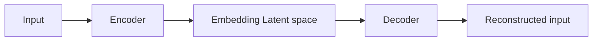

## Key element learned

#### Aggregation function uses:
- GCN: mean
- GraphSage: max, mean, LSTM (LSTM not recommended)
- GAT: sum

#### Planetoid vs TUDataset:
- Planetoid:
    - Designed for node classification tasks 
    - Single graph per dataset:
        - datasets consist of a single graph where the nodes represent entities
        - edges represent relationships
        - labels are assigned to a subset of the nodes.
    - Semi supervised learning: only a fraction of nodes have labels during training
    - Common datasets: `Cora`, `CiteSeer`, `PubMed`
    - Use case: knowledge graph, citation network

- TUDataset:
    - Designed for graph classification tasks
    - Multiple graphs per dataset:
        - consists of a collection of multiple small, independent graphs, each with a label.
        - Often lacks node or edge features depending on the dataset.
    - Common datasets: `MUTAG`, `PTC`, `PROTEINS`, `IMDB-BINARY`
    - Use case: molecular graphs, social networks

#### Autoencoders
- Encoder: maps input graph or image to a latent space
- Decoder: reconstructs the input graph or image from the latent space
- Loss function: measures the difference between the input and the reconstructed graph or image
- Use case: anomaly detection, denoising, dimensionality reduction
- Works as unsupervised learning

#### Variational Autoencoders (VAE)
- Encoder: maps input graph or image to a latent space
- Decoder: reconstructs the input graph or image from the latent space
- Loss function: measures the difference between the input and the reconstructed graph or image
- Use case: anomaly detection, denoising, dimensionality reduction
- Works as unsupervised learning
The difference between VAE and AE is that VAE uses a probabilistic approach to generate the latent space, which allows for sampling from the latent space.

Note: Backpropagation does not work with sampling, so the reparameterization trick is used to make the sampling process differentiable.